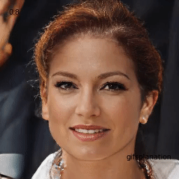
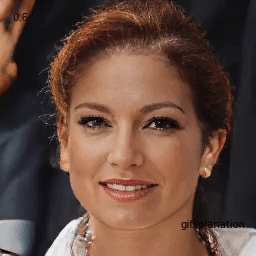
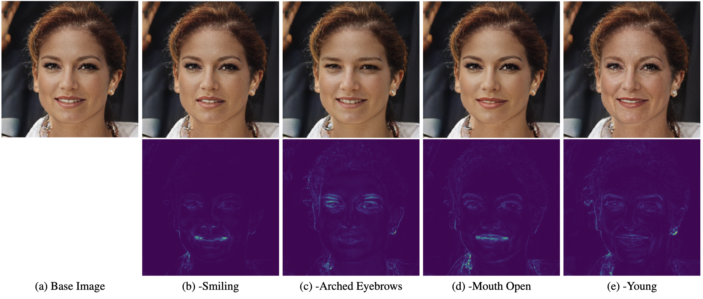

# Latent Shift - A Simple Autoencoder Approach to Counterfactual Generation


[](https://colab.research.google.com/github/ieee8023/latentshift/blob/main/example.ipynb)

# The idea

Read the paper: https://arxiv.org/abs/2102.09475

Watch a video: https://www.youtube.com/watch?v=1fxSDP8DheI

The main diagram:


## Animations/GIFs

| Smiling | Arched Eyebrows|
| ----------- | ----------- |
|  |   | 

|Mouth Slightly Open  | Young  |
| ----------- | ----------- |
|  |   | 

# Generating a transition sequence

For a predicting of `smiling`


# Multiple different targets




  
# Comparison to traditional methods 

For a predicting of `pointy_nose`


# Getting Started

```bash
$pip install latentshift
````


```python3
import latentshift
# Load classifier and autoencoder
model = latentshift.classifiers.FaceAttribute(download=True)
ae = latentshift.autoencoders.VQGAN(weights="faceshq", download=True)

# Load image
input = torch.randn(1, 3, 1024, 1024)

# Defining Latent Shift module
attr = captum.attr.LatentShift(model, ae)

# Computes counterfactual for class 3.
output = attr.attribute(input, target=3)
```
