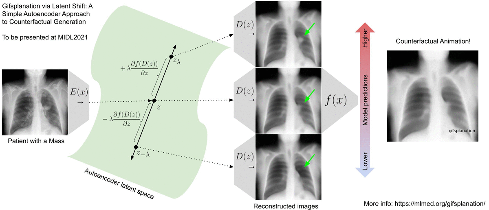
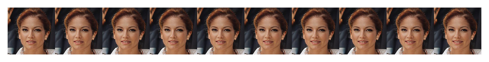
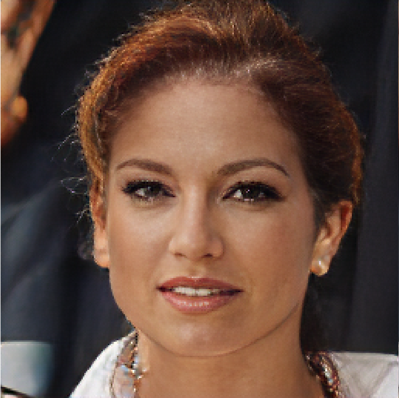
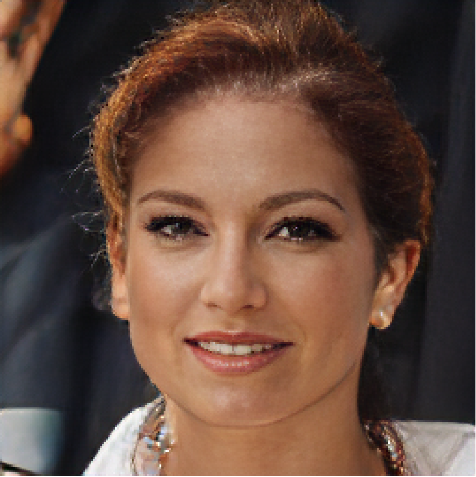
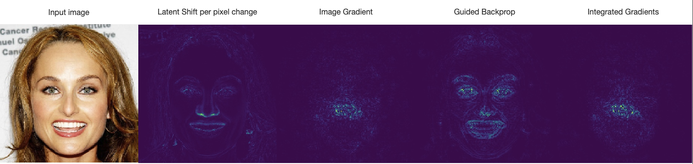

# Latent Shift - A Simple Autoencoder Approach to Counterfactual Generation


[](https://colab.research.google.com/github/ieee8023/latentshift/blob/main/example.ipynb)

# The idea

Read the paper: https://arxiv.org/abs/2102.09475

Watch a video: https://www.youtube.com/watch?v=1fxSDP8DheI

The main diagram:



# Example

For a predicting of `smiling`



| Counterfactual (smiling removed) | Base reconstruction |
| ----------- | ----------- |
|  |   |


# Comparison

For a predicting of `pointy_nose`



# Getting Started

```python3
# Load classifier and autoencoder
model = classifiers.FaceAttribute()
ae = autoencoders.Transformer(weights="celeba")

# Load image
input = torch.randn(1, 3, 1024, 1024)

# Defining Latent Shift module
attr = captum.attr.LatentShift(model, ae)

# Computes counterfactual for class 3.
output = attr.attribute(input, target=3)
```
